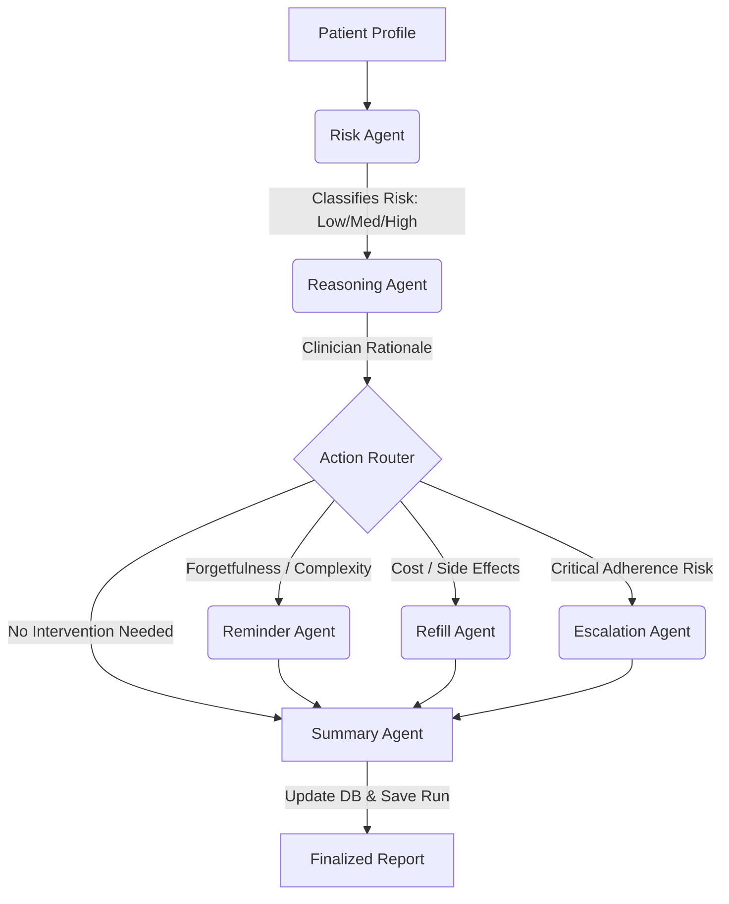

# CareSync: Multi-Agent Medication Adherence System

CareSync is a state-of-the-art multi-agent AI framework designed to monitor patient medication adherence, analyze compliance barriers, and deploy targeted interventions. 

The system leverages a specialized multi-agent graph architecture, coordinating four distinct agent roles to automate patient safety audit loops.

---

## Architecture Overview

The multi-agent workflow runs sequentially for each patient in the following state machine graph:



1. **Risk Agent**: Evaluates patient metrics (adherence history, age, refill delays) using a trained Random Forest Classifier to assign a risk score (Low, Medium, High).
2. **Reasoning Agent**: Conducts clinical analysis of the patient's specific barrier (e.g., Side effects, Forgetfulness, Cost) and chooses the appropriate intervention.
3. **Action Agents**:
   - **Reminder Agent**: Dispatches personalized SMS notifications with tailored adherence tips.
   - **Refill Agent**: Manages renewal options, checks for generic copay cards, and prompts refill confirmation.
   - **Escalation Agent**: Immediately triggers clinical alarms, routing patient profiles to human Care Managers.
4. **Summary Agent**: Compiles transaction logs, logs results in the audit trails, and commits updated states to the database.

---

## Folder Structure

```
healthcare-adherence-agent/
│
├── backend/
│   ├── main.py                     # FastAPI entry point & API endpoints
│   ├── requirements.txt            # Python dependencies
│   │
│   ├── agents/                     # Multi-Agent logic
│   │   ├── risk_agent.py           # Assesses patient adherence risk level
│   │   ├── reasoning_agent.py      # Clinician reasoning to determine action
│   │   ├── reminder_agent.py       # Custom SMS medication alerts
│   │   ├── refill_agent.py         # Refill renewal and cost assistance handler
│   │   ├── escalation_agent.py     # Critical provider alert routing
│   │   └── summary_agent.py        # Compiles audit logs & updates SQLite database
│   │
│   ├── workflows/
│   │   └── adherence_graph.py      # Sequentially orchestrates the agent state graph
│   │
│   ├── models/
│   │   └── risk_model.pkl          # Trained Random Forest classifier binary
│   │
│   ├── schemas/
│   │   └── patient_schema.py       # Pydantic schemas (Patient, Agent logs, Graph state)
│   │
│   ├── database/
│   │   └── db.py                   # SQLite database connector & initializer
│   │
│   └── services/
│       ├── notification_service.py # Mock SMS/Email/Escalation transmission
│       └── audit_service.py        # Audit trail logging service
│
├── frontend/
│   ├── index.html                  # Single Page React App UI (CDN-based)
│   └── style.css                   # Dark mode CSS with premium aesthetics
│
├── data/
│   └── synthetic_patients.csv      # Generated patient dataset (150 records)
│
└── README.md                       # Documentation & usage manual
```

---

## Setup & Running Guide

### 1. Backend API Server

Ensure Python 3.8+ is installed. Navigate to the project root and install the dependencies:

```bash
pip install -r backend/requirements.txt
```

Launch the FastAPI backend server:

```bash
python backend/main.py
```
The backend will run on `http://127.0.0.1:8000`. On startup, it automatically loads patient details from the synthetic CSV file into a local SQLite database (`backend/database/adherence.db`).

### 2. Frontend Dashboard

Since the React app is served via CDN, **no node compilation or local server is strictly required**. 

* **Option A (Simplest)**: Double-click and open `frontend/index.html` in your web browser.
* **Option B (Python Server)**: Keep a local dev environment by launching a lightweight python server at the project root:
  ```bash
  python -m http.server 3000 --directory frontend
  ```
  Navigate to `http://localhost:3000` in your browser.

---

## Verification Plan

1. **Verify Backend Status**:
   - Access `http://127.0.0.1:8000/` in your browser or client. You should receive a status dictionary: `{"message": "...", "status": "running"}`.
   - Swagger interactive docs are available at `http://127.0.0.1:8000/docs`.
2. **Execute Agent Audits**:
   - Open the CareSync Dashboard.
   - Select a patient from the sidebar (e.g. high-risk patient showing delayed refills or side-effect barriers).
   - Click **"Run Adherence Audit"**. 
   - Watch the multi-agent running panel animate and log outputs live as the Risk Agent, Reasoning Agent, Action Agent, and Summary Agent execute step-by-step.
   - Inspect the **Active Dispatched Alerts** panel to see the mock SMS messages or provider escalations sent out.
